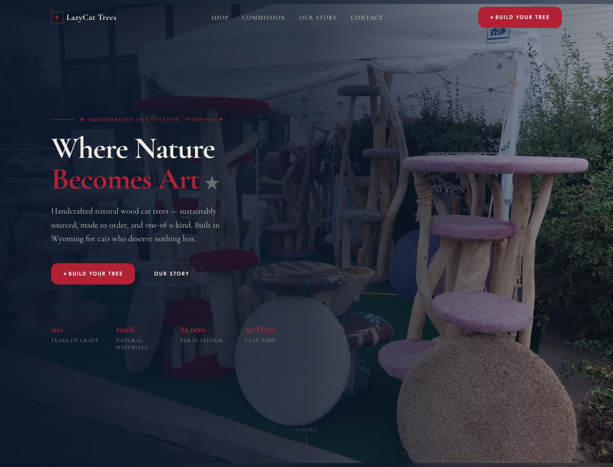

# LazyCat Trees

A premium e-commerce website for LazyCat Trees, a Cheyenne, Wyoming maker of handcrafted natural wood cat trees.

**Live demo:** [lazycat-trees.vercel.app](https://lazycat-trees.vercel.app)



## What It Does

LazyCat Trees presents a boutique storefront for made-to-order cat furniture:

- Immersive brand homepage with product photography, craft story, stats, and featured collections.
- Shop page with configurable platform count, carpet colors, and price calculation.
- 3D cat tree configurator built with Three.js.
- Stripe Checkout flow for secure ordering.
- Commission and contact forms powered by Resend.
- Supporting pages for story, FAQ, contact, checkout success, and custom orders.

## Tech Stack

- Next.js 16 App Router
- React 19
- TypeScript
- Tailwind CSS v4
- Three.js
- Stripe Checkout
- Resend
- Vercel for deployment

## Run Locally

```bash
npm install
npm run dev
```

Then open [http://localhost:3000](http://localhost:3000).

## Environment Variables

The payment and email flows require:

- `STRIPE_SECRET_KEY`
- `RESEND_API_KEY`
- `CONTACT_EMAIL`
- `NEXT_PUBLIC_SITE_URL`

`.env.local.example` also includes optional Stripe values for future client-side Stripe or webhook automation.

## Project Status

This is a full storefront prototype with production-oriented product, checkout, and inquiry flows. Future improvements could include order management, inventory controls, and a CMS for product photography.

## License

Proprietary - LazyCat Trees, LLC. All rights reserved.
